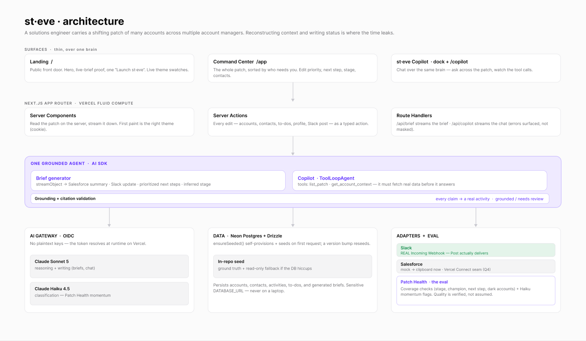

# st-eve

**A grounded copilot for solutions engineers.** I carry a shifting patch of accounts, often spread across more than one account manager, sometimes more than one patch. st-eve takes the raw context of that patch (meeting notes, emails, Slack threads) and turns it into decisions I can actually act on, so my hours go to customers instead of status updates.

The name's a pun on *Steve*, the copilot. The *eve* half nods to Vercel's agent framework, and [why I didn't build on it](#decisions--trade-offs) is below.

**Live:** <https://st-eve-se-sidekick.vercel.app>

## The problem

The hard part of the job isn't any one account, it's all of them at once. Every day is context-switching: work out where a deal stands before a call, write a weekly summary to paste into Salesforce, post a Slack update to the account channel, decide the next step and how urgent it is, and keep a mental model of what stage each opportunity is really in. Do that across the whole patch and most of the week goes to reporting about the work instead of doing it. And things slip quietly: an account goes dark, a champion leaves, a next step never gets set.

st-eve does the reconstructing and the drafting. I stay on the accounts, and it handles the busywork and helps make sure nothing falls through the cracks.

## What it does

It's one grounded agent behind two surfaces.

- **Weekly brief.** One pass over an account's activity timeline gives you a Salesforce-ready summary, a Slack update, prioritized next steps, and the stage it looks like the deal is really in (with a confidence), streamed as it writes. Every claim is cited to a real activity, and if something can't be backed up it gets dropped and the brief is flagged *needs review*, so it doesn't make things up. **Copy to Salesforce** drops the summary on your clipboard, and **Post to Slack** renders a real Slack message (channel, your name, the time you posted it) and sends it through the webhook.
- **st-eve Copilot.** The same agent as a chat, floating on every page and full-screen at `/copilot`. Ask it anything about the patch and it pulls the real context with read-only tools before it answers, and it shows you which tools it called and which model handled it. No account is a black box.
- **Command Center** (`/app`). The whole patch on one screen, sorted by priority, with live counts (at risk, waiting on a next step, technical wins). Edit priority, next step, stage, account managers, and the buying committee right in place. Add or drop accounts, filter by stage, priority, or AM.
- **Board.** The same patch as a drag-and-drop Kanban by stage. Move a card to restage a deal and it persists everywhere.
- **Patch Health.** st-eve checking its own patch: does every opportunity have a stage, a next step, a champion, a close target, and a recent touch? It names the gaps, then reads each account's recent activity with a fast model and flags the ones that look like they're quietly stalling. This is the eval, in plain English instead of a confusion matrix.

There's a public landing page at `/` that frames the value and drops you into the app, and the whole thing re-skins live across four themes.

## How it works



The full, editable diagram lives in [Figma](https://www.figma.com/design/oNqoh4wj7AszkEHIzmF5hY?node-id=57-2).

- **Next.js 16 (App Router)** on Fluid Compute. The read surfaces are server components that stream, and briefs, edits, and the health check run through server actions and route handlers (`/api/brief`, `/api/copilot`).
- **AI SDK v7** for the agent. The brief streams as a structured object (`streamObject`), and the copilot is a `ToolLoopAgent` with read-only tools. Same brain, two surfaces.
- **AI Gateway, routed per task.** Sonnet 5 writes the weekly brief, where care matters more than speed. Haiku 4.5 runs the copilot chat and the Patch Health classification, where a fast, cheap reply matters more. Swapping any of them (say, Gemini Flash for the chat once there are gateway credits) is one line, and provider failover comes for free.
- **Neon Postgres + Drizzle** hold the live patch, contacts, to-dos, and generated briefs. The demo data is a versioned synthetic seed of real Vercel customers with believable sales motions, so it's deterministic and it doubles as Patch Health's pinned ground truth. The app provisions and seeds Neon itself on the first request, so there's nothing to run by hand.
- **Adapters** keep integrations behind one seam. Slack is a real Incoming Webhook. The Salesforce write-back is the documented Vercel Connect seam, and for now the UI just copies the summary to your clipboard.
- **Product analytics with PostHog.** Autocapture, session recording, and geoIP locations show how the demo actually gets used, and a handful of semantic events cover the moments that matter, like a brief generated or a Slack update posted. Everything routes through a same-origin `/ingest` proxy so content blockers don't drop it, and the write-only public project key comes from an env var, not the repo.

## Decisions & trade-offs

The main calls I made, and why. I'd genuinely welcome pushback on any of them.

- **Cut the context-switching, don't just pile on features.** Every surface is there to collapse "where does this stand, what's next, who do I tell" into one place. The depth is the grounding and the health check, not the feature count.
- **Grounding is a product behavior, not a prompt.** Every citation is checked against a real activity id, and anything that doesn't resolve gets dropped and the brief is flagged *needs review*. It's there to keep me honest: with my manager, the account team, and anyone who needs visibility into the patch, every claim in a brief traces back to something that actually happened.
- **Patch Health over a confusion matrix.** An eval only helps if the person relying on it understands it. Coverage checks plus a momentum read answer "is anything slipping?" in plain English, and the momentum read runs on the cheap model, which is where the tiered routing earns its keep.
- **Built on the AI SDK directly, not on `eve`.** `eve` is Vercel's filesystem-first durable-agent framework, and it's what makes the name work, but it's still beta. For a live demo I wanted reliability, so st-eve runs on the stable AI SDK that eve is built on. `eve` is the obvious path to production later (durable sessions, Agent Runs observability), and I'd move to it once it's GA.
- **Synthetic data with swappable adapters.** Real Vercel customers, invented sales motions, and no real customer data in a repo people are going to read. Slack is already wired for real, and the rest are the documented Connect seam.
- **Secrets never touch the repo.** No standing API key. The gateway authenticates with OIDC on Vercel so the token resolves at runtime, Neon's `DATABASE_URL` is a Sensitive env var, and the Slack webhook is too. The DB credential never comes down to a laptop, so it can't leak from one.

## Running it

```bash
pnpm install
pnpm dev      # http://localhost:3000, runs on a deterministic fallback, no secrets needed
pnpm eval     # Patch Health from the CLI (non-zero exit if any coverage check has a gap)
```

**Zero config by default.** With no gateway credential, brief generation and the momentum read fall back gracefully, and with no `DATABASE_URL` the app reads the in-repo seed. On Vercel it's the real thing: Sonnet 5 and Haiku 4.5 over OIDC, and Neon seeds itself on the first request. See `.env.local.example`.

## Design

- **Architecture diagram:** <https://www.figma.com/design/oNqoh4wj7AszkEHIzmF5hY?node-id=57-2>
- **Figma file** (wireframes, the four-theme matrix, the landing): <https://www.figma.com/design/oNqoh4wj7AszkEHIzmF5hY>
- **Deployed:** <https://st-eve-se-sidekick.vercel.app>
